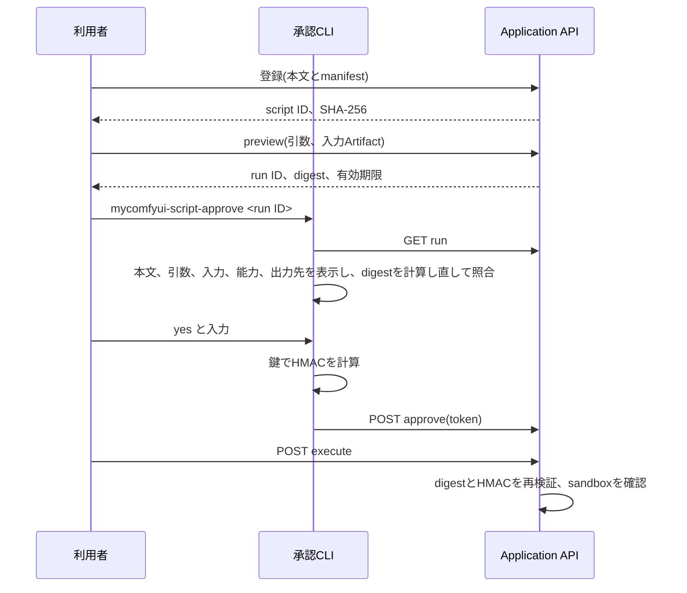

# ADR 0003:ユーザースクリプトの隔離実行と承認

- 状態:採用
- 決定日:2026-09-23
- 対象:#111 ユーザースクリプトの登録・承認・実行
- 関連:[ADR 0001](0001-application-stack-and-boundaries.md)、[ADR 0002](0002-remote-gpu-host.md)

## 結論

ユーザースクリプトは、Application APIとは別のプロセスとして、bubblewrap(`bwrap`)で作ったsandboxの中で実行する。資源の上限はsystemdのuser scope(cgroup v2)と`prlimit`で掛ける。

実行するには、次のすべてを満たす必要がある。

1. 設定`user_scripts_enabled`を利用者が明示的に`true`にしている。既定は`false`とする。
2. 実行要求(preview)の内容digestに対し、利用者だけが読める鍵によるHMAC署名(承認token)が付いている。tokenは手元のCLIだけが作り、REST APIでは作れない。
3. 実行の直前にscript本文、入力、能力、出力先からdigestを計算し直し、承認時の値と一致する。
4. sandboxが起動できる。起動できなければ実行せずに失敗させる(fail closed)。

## 背景

Application APIは認証を持たず、loopbackへbindすることだけで公開範囲を絞っている(ADR 0001)。同じホストのブラウザで開いた悪意あるページ、DNS rebinding、同じホストの他のプロセスは、このAPIへ任意の要求を送れる。この状態で「登録したscriptを実行する」Endpointを置くと、無認証の要求からホスト上で任意のコードを実行できてしまう。

Issue #111は、隔離方式と脅威モデルを確定するまで実行経路を追加しないことを実装停止条件にしている。本ADRはその確定を記録する。

## 保護する資産

|資産|場所|脅威|
|---|---|---|
|SQLite DB、Artifact store|`data_root`|改ざん、削除、読み出し|
|利用者のホームディレクトリ、SSH鍵、CLIの認証情報|`$HOME`|読み出しと外部への持ち出し|
|Application APIの環境変数と資格情報|APIプロセス|scriptへの継承|
|LAN上のRemote PC(ComfyUI、voice-runner)|ネットワーク|認証の無いBackendの操作(ADR 0002)|
|ホストの計算資源|CPU、メモリ、ディスク、プロセス数|枯渇によるサービス停止|
|承認鍵|`data_root/secrets/user-script-approval.key`|盗まれると承認を偽造される|

## 脅威モデル

攻撃者として次を想定する。

- **T1 無認証のREST要求。** ブラウザ経由のCSRF、DNS rebinding、同じホストで動く別のプログラム。APIのどのEndpointでも呼べる。
- **T2 悪意あるscript本文。** 利用者が中身を十分に読まずに登録した第三者由来のscript。sandboxの中で任意のコードを実行する。
- **T3 承認後の差し替え。** 承認した後、実行する前にscript、入力Artifact、引数、制限値を変える。

次は対象外とする。

- 利用者と同じOSアカウントで任意のコードを実行できる攻撃者。承認鍵もDBも読めるため、本ADRの境界では防げない。
- Linuxカーネルやbubblewrapの脆弱性を使ったsandboxからの脱出。seccompフィルタは本ADRでは導入せず、残存リスクとして扱う。

### 対策

|脅威|対策|
|---|---|
|T1が承認を作る|承認tokenは鍵によるHMAC-SHA256とする。鍵はAPIの応答にもログにも出さない。REST APIは検証だけを行い、tokenを作るEndpointを持たない|
|T1がtokenを使い回す|tokenの署名対象にrun ID、digest、有効期限を入れる。runごとに承認は1回だけ受け付ける|
|T1が実行する|承認済みで有効期限内のrunだけを実行する。機能が無効なら、登録、preview、承認、実行をすべて拒否する|
|T2がホストの資産を読む、書く|sandboxから見えるのは読み取り専用の`/usr`、今回のrun用に複製した入力、script本文、出力用ディレクトリだけとする。`$HOME`、`/etc`、`data_root`、DB、承認鍵はmountしない|
|T2が資格情報を得る|`bwrap --clearenv`で環境変数を空にする。`bwrap`自体に渡す環境もsystemdへの接続に必要な値だけに絞る。親プロセスのfile descriptorは閉じる|
|T2がネットワークへ出る|`--unshare-all`でnetwork namespaceを分け、loopback以外のinterfaceを持たせない。能力manifestのnetworkは`none`だけを受け付ける|
|T2が資源を使い尽くす|後述の上限を掛ける|
|T2が出力経由でホストのファイルを読ませる|出力の回収ではsymlinkを辿らず、通常ファイルでリンク数が1のものだけを取り込む|
|T3|実行直前にscript本文とSHA-256、入力Artifactの実ファイルのSHA-256を計算し直す。入力はrun専用のディレクトリへ複製してから検証し、検証したものをsandboxへmountする。検証と使用の間に差し替えられない|

## 隔離の方式

### 採用:bubblewrapによる別プロセスのrunner

起動するコマンドは引数配列として組み立て、shellを通さない。

```text
systemd-run --user --scope --quiet --collect --unit=<run固有の名前>
    -p TasksMax=<上限> -p MemoryMax=<上限> -p MemorySwapMax=0 --
  prlimit --cpu=<秒> --fsize=<bytes> --core=0 --nofile=<数> --
  bwrap --unshare-all --die-with-parent --new-session --clearenv
    --ro-bind /usr /usr (/bin、/lib、/lib64、/sbinはホストに合わせてsymlinkかro-bind)
    --proc /proc --dev /dev --tmpfs /tmp
    --ro-bind <scriptの複製> /sandbox/script.py
    --ro-bind <入力の複製> /sandbox/inputs/<名前>
    --bind <出力用ディレクトリ> /sandbox/output
    --chdir /sandbox/output
    -- /usr/bin/python3 -I /sandbox/script.py <引数...>
```

- 実行主体はAPIと同じOSアカウントとする。ただし特権は持たず、user namespaceの中で動く。setuidの`bwrap`は前提にしない。
- 実行できる言語はPythonだけとし、interpreterは`/usr/bin/python3`を`-I`(isolated mode)で起動する。
- sandboxの中で利用者が触れる場所は3つに限る。入力は`/sandbox/inputs`に読み取り専用で置く。出力は`/sandbox/output`に書く。一時領域は`/tmp`のtmpfsとする。
- 実行ファイルは絶対パスで設定する。`PATH`の探索に頼らない。

### 資源の上限

|対象|手段|既定の上限(設定で下げられる)|
|---|---|---|
|CPU時間|`prlimit --cpu`(RLIMIT_CPU)|300秒|
|メモリ|cgroup `MemoryMax`と`MemorySwapMax=0`|2 GiB|
|プロセス数|cgroup `TasksMax`|64|
|経過時間|API側で計測し、超えたらprocess groupとscopeを止める|600秒|
|1ファイルの大きさ|`prlimit --fsize`(RLIMIT_FSIZE)|出力の総量と同じ|
|出力の総量とファイル数|実行中に出力ディレクトリを定期的に数え、超えたら止める。回収時にも検証する|256 MiB、64ファイル|
|stdoutとstderr|読み取り量を数え、上限を超えたら止める|各1 MiB|

scriptごとの能力manifestは上の上限以下の値だけを受け付ける。実行時の上限はmanifestの値とする。

RLIMIT_NPROCはsandboxの外にある利用者の全プロセスを数えるため、プロセス数の上限には使わない(実測で、上限を小さくすると`bwrap`の起動自体が失敗した)。プロセス数の上限にはcgroupを使う。

### 既知の制約

- RLIMIT_CPUはプロセスごとの上限である。scriptが子プロセスを作ると、全体のCPU時間は最大で`TasksMax × CPU時間`まで伸びる。cgroupの`CPUQuota`で全体を絞る案は採らなかった。実測で、この環境のsystemd user managerに委譲されているcontrollerは`memory`と`pids`だけで、`cpu`が無かった。この状態で`CPUQuota`を付けても効かない。全体の抑止は経過時間の上限に頼る。
- 同時に1件しか実行しない制約は、APIプロセスのメモリ上で管理している。APIを複数workerで動かすとこの制約が崩れる。本機能はAPIを単一プロセスで動かす前提とする。
- 出力の総量は0.5秒ごとの計測で止める。止めるまでの間に、上限を一時的に超えることがある。1ファイルの大きさはRLIMIT_FSIZEで抑える。

### 比較した案

|案|採否|理由|
|---|---|---|
|bubblewrap|採用|daemonを使わず、起動が速い。環境変数を空にでき、失敗の判定も書きやすい|
|Docker、rootless Podman|不採用|Docker daemonへの接続はroot相当の権限になる。imageの管理と起動時間も増える|
|同じプロセスでの制限付き実行(`exec`の制限など)|不採用|Pythonの言語内sandboxは脱出手段が多く、境界にならない|

## 承認の方式



- 鍵は機能が有効なAPIの起動時に、存在しなければ`data_root/secrets/`へ32 bytesの乱数として作る。ディレクトリを`0700`、ファイルを`0600`とする。groupやotherに権限がある鍵は、APIもCLIも使わない。
- tokenは`HMAC-SHA256(鍵, "mycomfyui.user-script-run.v1" + run ID + digest + 有効期限)`の16進表記とする。
- 承認の有効期限はpreviewから一定時間(既定15分)とし、期限までに実行しなければ承認を取り直す。
- 鍵を作り直すと、未実行の承認はすべて無効になる。

## 失敗時の扱い

- sandboxの起動確認(同じ引数構成で`/usr/bin/true`を実行する)に失敗したら、runを実行せず`SANDBOX_UNAVAILABLE`で拒否し、監査記録へ残す。
- 実行中にAPIが停止したrunは、次の起動で`failed`にする。sandboxは`--die-with-parent`で道連れにする。
- 上限を超えたrunは`failed`とし、理由(`timeout`、`output_limit`など)を記録する。上限超過時のArtifactは回収しない。
- 出力の回収に失敗したら、保存済みのファイルを消し、runを`failed`にする。

## 保持する記録

- script:本文、SHA-256、能力manifest、登録日時。本文は登録後に変更しない。
- run:引数、入力(Artifact IDとSHA-256)、能力、出力先、digest、承認token、状態、終了コード、stdoutとstderr(上限まで)、生成したArtifact ID。
- 監査記録:登録、preview、承認、承認の拒否、実行、実行の拒否、終了、取消を追記だけで残す。

## Web UI

security reviewが終わるまで、Web UIからscriptの実行経路は有効にしない。APIとCLIだけを提供する。

## 影響

- 実行には`bwrap`、`prlimit`、systemdのuser managerが必要になる。Linux(WSL2を含む)以外のホストでは、機能を有効にしても実行はfail closedになる。
- 承認のたびに端末でCLIを操作する手間が増える。無認証APIのままで承認の偽造を防ぐための代償として受け入れる。
