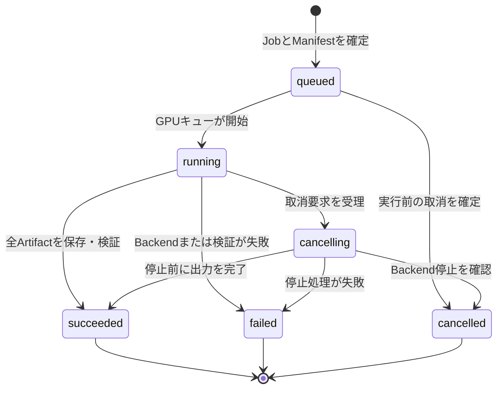

# 生成履歴と資産保存の設計

## 目的

画像生成MVPで生成要求、出力、実行時点の入力、再利用可能なRecipe、承認を追跡する。SQLiteはApplication APIだけが書き込み、Canon本文は保存しない。[MyComfyUI計画](../PLAN.md)と[ai-media参照契約](../contracts/ai-media-read-api-v1.md)の不変参照を前提とする。

## 共通規則

- IDはUUIDv7文字列とし、作成後に変更しない。
- 時刻はUTCのRFC 3339文字列で記録する。
- 外部ファイル参照は保存先ルートからの相対パスに限定し、絶対パスと親ディレクトリ参照を保存しない。
- SHA-256は小文字16進数64文字で保存する。ファイル内容が変われば別のArtifactとして記録する。
- Canon、Scene、Shot、入力素材の外部参照は`source_locator`、不変`revision`、repository相対`path`、`sha256`の組で固定する。Canon本文をSQLite、Manifest、Artifact領域へ複製しない。
- `created_at`と作成時の値は更新しない。訂正、再実行、採否変更は後述の許可された可変項目または新規レコードで表す。

## 最小データSchema

### GenerationJob

|項目|必須|内容|更新可否|
|---|---|---|---|
|`id`|必須|Job ID|不可|
|`kind`|必須|`image`、将来の`video`、`voice`、`music`、`compose`|不可|
|`state`|必須|現在の実行状態|状態遷移規則に従う|
|`scene_ref`、`shot_ref`|必須|対象Scene/Shotの不変参照|不可|
|`recipe_id`|必須|使用したRecipe ID|不可|
|`manifest_id`|必須|実行時スナップショットのManifest ID|不可|
|`parent_job_id`|任意|派生元Job ID|不可|
|`queue_sequence`|必須|GPUキュー投入順|不可|
|`cancel_requested_at`|任意|取消要求時刻|取消要求時のみ設定|
|`started_at`、`finished_at`|任意|開始・終了時刻|それぞれ1回だけ設定|
|`failure_code`、`failure_message`|任意|失敗理由|`failed`時のみ1回設定|

`parent_job_id`は同じProject内の既存Jobを指す。循環参照は禁止する。Jobを削除せず、表示対象から外す場合も履歴は保持する。

### Artifact

|項目|必須|内容|更新可否|
|---|---|---|---|
|`id`|必須|Artifact ID|不可|
|`job_id`|必須|作成元Job ID|不可|
|`kind`|必須|`image`、`video`、`audio`、`workflow`、`log`など|不可|
|`relative_path`|必須|Artifact store内の相対パス|不可|
|`sha256`、`byte_size`、`media_type`|必須|内容識別と表示用メタデータ|不可|
|`parent_artifact_id`|任意|派生元Artifact ID|不可|
|`created_at`|必須|保存完了時刻|不可|
|`decision`、`decision_at`|必須|`undecided`、`accepted`、`rejected`と判断時刻|判断時のみ更新可|

`job_id`は成功したJobを指す。`parent_artifact_id`は同一Project内の既存Artifactを指し、循環参照は禁止する。保存済みファイルを置換しない。再出力は別Artifactとして記録する。

### GenerationManifest

|項目|必須|内容|更新可否|
|---|---|---|---|
|`id`|必須|Manifest ID|不可|
|`job_id`|必須|対象Job ID|不可|
|`engine`、`engine_version`|必須|実行Backendとバージョン|不可|
|`model`|必須|モデル識別子、版、SHA-256|不可|
|`seed`、`resolved_prompt`、`parameters`|必須|解決済みseed、最終prompt、実行パラメータ|不可|
|`input_refs`|必須|入力素材、Scene、Shot、Canonの不変参照|不可|
|`workflow_artifact_id`|必須|実行時Workflow JSONのArtifact ID|不可|
|`created_at`|必須|スナップショット確定時刻|不可|

ManifestはJobごとに1件とする。`parameters`はJSON object、`input_refs`は不変参照の配列として保存する。Workflow JSONはArtifact storeへ書き出し、そのSHA-256とArtifact IDで参照する。ManifestとArtifactの内容は変更しない。

### Recipe

|項目|必須|内容|更新可否|
|---|---|---|---|
|`id`|必須|Recipe ID|不可|
|`name`、`kind`|必須|利用者向け名称と生成種別|不可|
|`engine`|必須|対象Backend|不可|
|`workflow_template_ref`|必須|登録済みWorkflow templateの不変参照|不可|
|`input_schema`、`defaults`|必須|受け取る変数と既定値|不可|
|`supersedes_recipe_id`|任意|置換したRecipe ID|不可|
|`created_at`|必須|作成時刻|不可|

Recipeの変更は更新ではなく新規Recipeで表し、必要なら`supersedes_recipe_id`で後継を結ぶ。Jobは実行時に使用したRecipe IDを保持する。

### ApprovalLog

|項目|必須|内容|更新可否|
|---|---|---|---|
|`id`|必須|承認記録ID|不可|
|`subject_type`、`subject_id`|必須|提案、Job、ファイル操作などの対象|不可|
|`requested_operation`|必須|実行予定の操作と対象のJSON|不可|
|`decision`|必須|`approved`、`rejected`、`expired`|不可|
|`actor_type`、`actor_id`|必須|提案者または承認者の種別と識別子|不可|
|`decided_at`|必須|判断時刻|不可|
|`expires_at`|任意|承認の有効期限|不可|

ApprovalLogは追記専用とする。承認済みの記録を編集・再利用せず、操作対象または差分が変わった場合は新しい承認を要求する。

## 参照整合性

- `GenerationJob.manifest_id`と`GenerationManifest.job_id`は1対1で一致する。
- `Artifact.job_id`、`GenerationManifest.workflow_artifact_id`、各親IDは削除連鎖を行わない外部キーとする。
- JobとArtifactの親子関係はProjectをまたがない。
- 外部参照の`revision`と`sha256`の検証に失敗した場合、記録済み値を更新せず、検証失敗としてJobを失敗させるか再実行不能として扱う。

## Job状態遷移

|状態|意味|遷移条件|
|---|---|---|
|`queued`|Manifest確定済みでGPU待ち|作成時の初期状態。取消を確定すれば`cancelled`、実行を開始すれば`running`。|
|`running`|Backendが実行中|Backend開始を確認してから設定する。出力を保存・検証できれば`succeeded`、失敗なら`failed`、取消要求を受理すれば`cancelling`。|
|`cancelling`|停止要求をBackendへ送信済み|停止確認後に`cancelled`。停止前に完全な出力が保存された場合だけ`succeeded`。停止処理の失敗は`failed`。|
|`succeeded`|出力とManifestの整合性を確認済み|終端状態。少なくとも1件の主出力ArtifactとWorkflow Artifactが必要。|
|`failed`|実行、保存、hash検証、停止処理のいずれかに失敗|終端状態。`failure_code`と利用者へ表示可能な`failure_message`を記録する。|
|`cancelled`|利用者の取消によって実行しなかった、または停止した|終端状態。`cancel_requested_at`を必須とする。|

状態変更はApplication APIだけが行う。同じ遷移要求を複数回受けても、終端状態を後戻りさせない。Jobの取消はArtifactやManifestを削除しない。

## Lineageと再実行

### 親子関係

- 通常の新規生成では`parent_job_id`と`parent_artifact_id`を設定しない。
- 既存Jobから再実行する場合は、必ず新しいJobと新しいManifestを作る。元Jobを更新しない。
- 再実行の新Jobは元Jobの`id`を`parent_job_id`へ設定する。入力Artifactを加工した場合は、新Artifactの`parent_artifact_id`へ元Artifactを設定する。
- lineageは親から子への有向非循環グラフとする。親を後から付け替えない。

### Exact Replay

Exact Replayは元Manifestを読み取り専用の入力として、当時の実行条件を復元する新しいJobを作る。

- 元Manifestの`engine`、`engine_version`、モデル識別子とhash、seed、解決済みprompt、parameters、`input_refs`、Workflow Artifactの内容を使う。
- 新JobのManifestには、再実行元ManifestのIDと実際に再解決・検証した各入力を記録する。元Manifestを更新しない。
- 指定revision、モデル、Workflow Artifact、入力ファイルが取得できないかhash不一致なら、Jobを開始しない。利用者へ不足項目を示し、現在の値へ暗黙に置き換えない。
- 実行可能な場合でも出力は新Artifactとして保存し、元Artifactを置換しない。

### Regenerate with Current Canon

Regenerate with Current Canonは元Jobの派生Jobを作り、Scene、Shot、Canon参照だけを現在の参照APIから解決し直す。

- 新Jobの`parent_job_id`に元Job IDを設定する。
- 新Manifestには新たに解決した`input_refs`とそのrevision、path、SHA-256を固定する。元ManifestのCanon参照を変更しない。
- Recipe、Workflow、モデル、seed、parametersの扱いは実行画面で明示する。既定では元Manifestを複製し、変更があれば新Manifestだけに記録する。
- 現在のCanonと元ManifestのCanon参照が異なる場合は、再生成前に差分警告を表示する。

## Canon更新警告

Artifact一覧と再実行画面は、Manifestの各Canon参照と現在の参照APIから解決した参照を比較する。`revision`、`path`、`sha256`のいずれかが異なる場合、Canon更新ありと表示する。警告は記録済みManifestやArtifactを変更せず、Exact Replayの入力を現在値へ切り替えない。

## 保存先と保持方針

### 設定可能なルート

Application APIは`data_root`を設定値として受け取り、その配下だけを管理する。既定値はOS標準の利用者データ領域とし、開発時だけリポジトリ直下の`var/`を明示設定できる。設定の優先順位はADR 0001に従い、アプリケーション既定値、ユーザー設定TOML、`MYCOMFYUI_`環境変数、CLI引数の順とする。

|区分|`data_root`からの相対先|内容|Git管理|
|---|---|---|---|
|SQLite|`db/mycomfyui.sqlite3`|Job、Artifact、Manifest、Recipe、ApprovalLogの正本|しない|
|Artifact store|`artifacts/<job-id>/`|生成画像、動画、音声、Workflow JSON、実行ログ|しない|
|入力素材cache|`inputs/<sha256>/`|取り込んだ利用者素材のコピー|しない|
|一時ファイル|`tmp/<job-id>/`|実行途中の出力とdownload|しない。Job完了後に削除可能|
|診断ログ|`logs/<yyyy-mm-dd>.jsonl`|Application APIとAdapterの構造化ログ|しない|

`data_root`の各パスは起動時に正規化し、ルート外へ脱出する値を拒否する。Artifactを参照するときはDBに保存した相対パスから解決し、利用者入力の絶対パスをManifestやログへ保存しない。

### Git管理の境界

Gitで管理するのはソース、Schema、設計文書、Workflow template、設定例、移植可能な小さなfixtureだけとする。SQLite、生成物、入力素材、実行時Workflowスナップショット、ログ、利用者固有の設定は追跡しない。大容量の生成物をGit LFSへ移すことも初期版では行わない。

`config/mycomfyui.example.toml`には項目名と相対例だけを置く。利用者の`data_root`、Backend URL、APIキー、token、cookie、資格情報を含む設定は追跡対象外のユーザー設定または環境変数へ置く。

### 秘密情報

- APIキー、認証header、cookie、OS資格情報ストアの参照値をSQLite、Manifest、Artifact名、ApprovalLog、構造化ログへ保存しない。
- Backend呼出しで秘密情報を使う場合、ログには操作名、結果、request IDだけを残し、header、URL query、本文から秘密情報を除外する。
- Workflow JSONに秘密値が含まれうるBackendでは、保存前に対象ノードを許可リストで検査する。検出時は保存せずJobを`failed`とし、値そのものを失敗理由へ出さない。

### 保持と削除

- `succeeded`のJob、Manifest、Artifact、ApprovalLogは利用者が明示削除するまで保持する。削除機能は後続Issueで設計し、初期版ではDBの親レコードだけを削除する操作を提供しない。
- `failed`と`cancelled`のJobも診断とlineageのため保持する。部分Artifactは`incomplete`として記録できるが、成功Artifactとして扱わない。
- `tmp/<job-id>/`だけは終端状態の確定後に削除できる。削除失敗はJob結果を上書きせず、診断ログへ記録する。
- Artifactの完全削除は、DBレコード、実ファイル、派生関係、再実行可能性に影響するため、対象一覧と影響を確認する明示操作に限定する。
