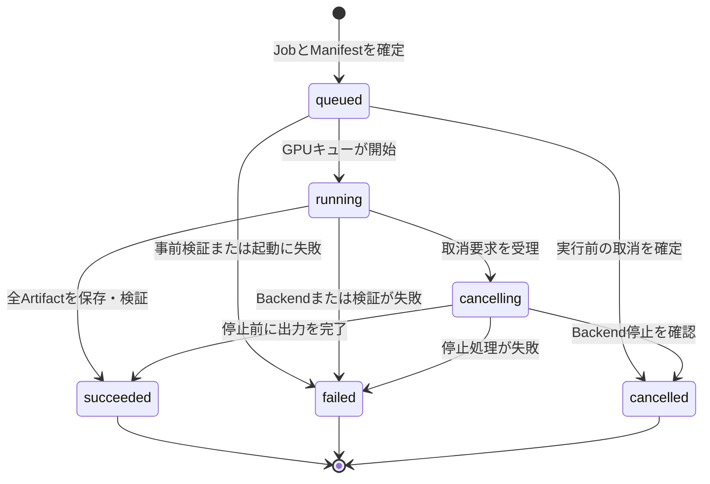

# 生成履歴と資産保存の設計

## 目的

画像生成MVPで生成要求、出力、実行時点の入力、再利用可能なRecipe、承認を追跡する。SQLiteはApplication APIだけが書き込み、Canon本文は保存しない。[MyComfyUI計画](../PLAN.md)と[ai-media参照契約](../contracts/ai-media-read-api-v1.md)の不変参照を前提とする。

## 共通規則

- IDはUUIDv7文字列とし、作成後に変更しない。
- 時刻はUTCのRFC 3339文字列で記録する。
- `relative_path`として保存するローカルファイル参照は、常に`data_root`からの相対パスに限定する。絶対パスと親ディレクトリ参照を保存しない。
- SHA-256は小文字16進数64文字で保存する。ファイル内容が変われば別のArtifactとして記録する。
- Canon、Scene、Shot、入力素材の外部参照は`source_locator`、不変`revision`、repository相対`path`、`sha256`の組で固定する。Canon参照はこれに`anchor`を加え、`canon_id`でも識別する。Canon本文をSQLite、Manifest、Artifact領域へ複製しない。
- `created_at`と作成時の値は更新しない。訂正、再実行、採否変更は後述の許可された可変項目または新規レコードで表す。

## 最小データSchema

### GenerationJob

|項目|必須|内容|更新可否|
|---|---|---|---|
|`id`|必須|Job ID|不可|
|`kind`|必須|`image`、将来の`video`、`voice`、`music`、`compose`|不可|
|`state`|必須|現在の実行状態|状態遷移規則に従う|
|`scene_ref`、`shot_ref`|必須|対象Scene/Shotの不変参照|不可|
|`recipe_id`|必須|使用したRecipe ID|不可|
|`manifest_id`|必須|実行時スナップショットのManifest ID|不可|
|`parent_job_id`|任意|派生元Job ID|不可|
|`queue_sequence`|必須|GPUキュー投入順|不可|
|`cancel_requested_at`|任意|取消要求時刻|取消要求時のみ設定|
|`started_at`、`finished_at`|任意|開始・終了時刻|それぞれ1回だけ設定|
|`failure_code`、`failure_message`|任意|失敗理由|`failed`時のみ1回設定|

`parent_job_id`は同じProject内の既存Jobを指す。循環参照は禁止する。Jobを削除せず、表示対象から外す場合も履歴は保持する。

### Artifact

|項目|必須|内容|更新可否|
|---|---|---|---|
|`id`|必須|Artifact ID|不可|
|`job_id`|必須|作成元Job ID。`queued`、`running`を含む削除されていないJobを指せる|不可|
|`kind`|必須|`image`、`video`、`audio`、`workflow`、`log`など|不可|
|`relative_path`|必須|`data_root`基準の相対パス（例: `artifacts/<job-id>/output.png`）|不可|
|`sha256`、`byte_size`、`media_type`|必須|内容識別と表示用メタデータ|不可|
|`availability`|必須|`complete`または`incomplete`。利用可能な完全成果物か診断用の部分成果物か|不可|
|`parent_artifact_id`|任意|派生元Artifact ID|不可|
|`created_at`|必須|保存完了時刻|不可|
|`decision`|必須|`undecided`、`accepted`、`rejected`|判断時のみ更新可|
|`decision_at`|任意|`accepted`または`rejected`にした時刻|判断時のみ1回設定|

`job_id`は生成前に作成済みのJobを指すため、Workflow Artifactは`queued`になる前に、出力Artifactは`running`中に保存できる。`succeeded`のJobに属するArtifactはすべて`complete`とし、`failed`または`cancelled`のJobに残す診断用の部分Artifactは`incomplete`とする。`incomplete`は通常の生成結果として表示・採否判定しない。`parent_artifact_id`は同一Project内の既存Artifactを指し、循環参照は禁止する。`undecided`では`decision_at`をNULLとし、採否を設定するときは両項目を同一更新で確定する。保存済みファイルを置換しない。再出力は別Artifactとして記録する。

### GenerationManifest

|項目|必須|内容|更新可否|
|---|---|---|---|
|`id`|必須|Manifest ID|不可|
|`job_id`|必須|対象Job ID|不可|
|`engine`|必須|実行Backend|不可|
|`engine_version`|任意|実行Backendのバージョン|実行開始時に1回だけ設定|
|`model`|必須|モデル識別子、版、SHA-256|不可|
|`seed`、`resolved_prompt`、`parameters`|必須|解決済みseed、最終prompt、実行パラメータ|不可|
|`input_refs`|必須|入力素材、Scene、Shot、Canonの不変参照、入力cache参照、Artifact参照|不可|
|`workflow_artifact_id`|必須|実行時Workflow JSONのArtifact ID|不可|
|`created_at`|必須|スナップショット確定時刻|不可|

ManifestはJobごとに1件とする。`engine_version`だけは実行Backendの実測値であり、Job作成時点では確定できない。Job作成時にBackendへ接続しなければキューへ積めなくなるため、Adapterが実行を開始した直後に1回だけ設定し、以後は上書きしない。値が入る前にJobが失敗した場合はNULLのまま残す。`parameters`はJSON objectとする。`input_refs`は、Canonなどの`source_locator`、`revision`、`path`、`sha256`を持つ不変参照、またはGit管理外の利用者素材用の`kind: "cached_input"`、`relative_path: "inputs/<sha256>/..."`、`sha256`、`media_type`、`byte_size`を持つ入力cache参照の配列として保存する。入力cache参照の`relative_path`も`data_root`基準とする。生成済みArtifactを入力に使った場合は、`kind: "artifact"`、`artifact_id`、`job_id`、`relative_path`、`sha256`を持つArtifact参照を並べる。`parent_artifact_id`は単一の親しか持てず、複数の入力を表現できないためである。`cached_input`とArtifact参照はどちらも参照APIで解決せず、`data_root`配下の実ファイルのhashを記録値と突き合わせて再現可否を判定する。Workflow JSONはArtifact storeへ書き出し、そのSHA-256とArtifact IDで参照する。ManifestとArtifactの内容は変更しない。

### Workflow

|項目|必須|内容|更新可否|
|---|---|---|---|
|`id`|必須|Workflow ID|不可|
|`name`|必須|同梱テンプレート名、またはAdapterのスナップショット名。一意|不可|
|`kind`|必須|生成種別|不可|
|`engines`|必須|このWorkflowを実行できるBackendの配列|不可|
|`created_at`|必須|登録時刻|不可|

Workflow本体はリポジトリ同梱のテンプレートとAdapterの実装であり、この表はその登録簿にあたる。行を足しても実行できるWorkflowは増えない。利用者入力から任意のJSONを実行させない制約は、同梱テンプレートの許可リストで維持する。`engines`を配列にするのは、音声のように同じ形のスナップショットを複数のBackendが使うためである。

### WorkflowVersion

|項目|必須|内容|更新可否|
|---|---|---|---|
|`id`|必須|Workflowバージョン ID|不可|
|`workflow_id`|必須|対象Workflow ID|不可|
|`version`|必須|版の識別子。Workflowごとに一意|不可|
|`template_sha256`|任意|同梱テンプレートのSHA-256。テンプレートファイルを持たない版ではNULL|不可|
|`variables`|必須|差し替えを許す変数と、その型・必須・書き込み先|不可|
|`model_slots`|必須|モデルファイル名を受け取る変数と、在庫確認に使うノード定義|不可|
|`inputs`|必須|素材の取り込みが要る入力|不可|
|`outputs`|必須|この版が生むArtifactの種別|不可|
|`created_at`|必須|登録時刻|不可|

版の内容は作成後に書き換えない。テンプレートやスナップショットの形が変われば新しい版を足す。Recipeが指している版を後から書き換えると、過去のJobがどの定義で実行されたか追えなくなるためである。`version`は、テンプレートファイルを持つComfyUI系がそのSHA-256、テンプレートを持たない音声と合成がスナップショットの版番号を文字列にしたものとする。

`workflow_version`はWorkflowの宣言であり、`GenerationManifest.workflow_artifact_id`が指す実行時スナップショットとは別物である。前者は「この版は何を受け取れるか」、後者は「この実行で何を送ったか」を表す。

### Recipe

|項目|必須|内容|更新可否|
|---|---|---|---|
|`id`|必須|Recipe ID|不可|
|`name`、`kind`|必須|利用者向け名称と生成種別|不可|
|`engine`|必須|対象Backend|不可|
|`workflow_template_ref`|必須|登録済みWorkflow templateの不変参照|不可|
|`workflow_version_id`|任意|参照するWorkflowバージョン ID。レジストリ導入前に作られたRecipeではNULL|不可|
|`input_schema`、`defaults`|必須|受け取る変数と既定値|不可|
|`supersedes_recipe_id`|任意|置換したRecipe ID|不可|
|`created_at`|必須|作成時刻|不可|

RecipeはWorkflow本体を書き換えず、指した版が宣言した変数の範囲でだけ値を差し替える。`input_schema`は版の宣言より狭くはできるが広くはできず、宣言に無い変数を指すRecipeでは投入時に失敗する。`workflow_version_id`を指定せずにRecipeを作った場合は、`workflow_template_ref`から登録済みの版を解決する。解決できなければNULLのままとし、作成は止めない。

Recipeの変更は更新ではなく新規Recipeで表し、必要なら`supersedes_recipe_id`で後継を結ぶ。Jobは実行時に使用したRecipe IDを保持する。

### ApprovalLog

|項目|必須|内容|更新可否|
|---|---|---|---|
|`id`|必須|承認記録ID|不可|
|`subject_type`、`subject_id`|必須|提案、Job、ファイル操作などの対象|不可|
|`requested_operation`|必須|実行予定の操作と対象のJSON|不可|
|`decision`|必須|`approved`、`rejected`、`expired`|不可|
|`actor_type`、`actor_id`|必須|提案者または承認者の種別と識別子|不可|
|`decided_at`|必須|判断時刻|不可|
|`expires_at`|任意|承認の有効期限|不可|

ApprovalLogは追記専用とする。承認済みの記録を編集・再利用せず、操作対象または差分が変わった場合は新しい承認を要求する。

`requested_operation`には操作種別、対象、実行予定の入力と、それらを正規化したJSONから算出したSHA-256 digestを含める。実行の直前に同じ手順でdigestを組み立て直し、記録した値と一致しない承認では実行しない。`expires_at`は承認時に既定の有効期間から設定し、期限を過ぎた承認も実行に使わない。期限の文字列を解釈できない記録は期限切れとして扱う。

### AgentProposal

|項目|必須|内容|更新可否|
|---|---|---|---|
|`id`|必須|提案ID|不可|
|`provider_id`|必須|提案を返したProvider|不可|
|`kind`|必須|`shot_breakdown`、`image_prompt`、`reference_candidates`、`recipe_draft`|不可|
|`state`|必須|`proposed`、`approved`、`rejected`、`applied`、`failed`|状態遷移規則に従う|
|`project_id`、`scene_id`|必須|対象Project/SceneのID|不可|
|`shot_id`|任意|対象ShotのID|不可|
|`recipe_id`|任意|承認後に投入するJobのRecipe ID|不可|
|`instruction`|必須|利用者の指示|不可|
|`request_context`|必須|Providerへ渡した入力。許可した表示用フィールドだけで組み立てる|不可|
|`output`|任意|提案本体。取得に失敗した提案はNULL|不可|
|`usage`|任意|費用、所要時間、往復回数の実測値|不可|
|`model`|任意|実行モデル|不可|
|`failure_code`、`failure_message`|任意|取得失敗の理由|`failed`時のみ1回設定|
|`applied_job_id`|任意|承認後に投入したJob ID|適用時のみ1回設定|
|`created_at`|必須|取得時刻|不可|
|`decided_at`|任意|承認または却下の時刻|判断時に設定。期限切れの承認を判断し直したときは更新する|

状態遷移は`proposed → approved → applied`、`proposed → rejected`とし、取得に失敗した提案は`failed`のまま残す。承認の有効期限が切れた場合だけ例外とし、`approved`から判断をやり直せる (`approved → approved`、`approved → rejected`)。期限切れの承認では適用できず、判断もやり直せないと提案が行き止まりになるためである。やり直した判断はApprovalLogへ追記し、過去の記録は書き換えない。`request_context`と`output`は作成後に更新しない。提案の取得だけでは生成Job、Artifact、Manifestを作らない。

`request_context`にはCanon本文を入れず、Canon参照は`path`、`anchor`、`note`に限る。APIキー、認証情報、環境変数、ローカル絶対パスも入れない。

### VoiceVerification

|項目|必須|内容|更新可否|
|---|---|---|---|
|`id`|必須|検証記録ID|不可|
|`job_id`|必須|対象の音声Job|不可|
|`artifact_id`|必須|検証した音声Artifact|不可|
|`dialogue_index`|必須|Shot内での台詞の位置|不可|
|`expected_text`|必須|Shotが持つ台詞本文|不可|
|`expected_reading`|任意|Shotが指定した読み。指定が無ければNULL|不可|
|`asr_text`|任意|ASRの書き起こし。実行しなかった、または失敗した場合はNULL|不可|
|`normalized_expected`、`normalized_asr`|任意|カタカナへ正規化した比較対象|不可|
|`match`|任意|正規化後の完全一致可否。検証していない場合はNULL|不可|
|`diff_ratio`|任意|不一致時の差分率。0.0で完全一致、1.0で共通部分なし|不可|
|`audio_sec`、`padded_sec`|必須|生成音声の尺と、パディング後の尺|不可|
|`target_duration_sec`|必須|Shotが求める尺|不可|
|`status`|必須|`verified`、`skipped`、`asr_failed`、`kana_unavailable`|不可|
|`created_at`|必須|記録時刻|不可|

台詞ごとに1件記録し、後から書き換えない。ArtifactへJSONとして持たせず表にするのは、台詞単位の一覧と不一致の絞り込みをAPIで返すためである。

読みの一致判定は表記では行わず、期待側 (`expected_reading`があればそれ、無ければ`expected_text`) とASRの書き起こしをカタカナへ正規化してから比較する。ASRは同音の別表記を返すため、表記のまま比べると読めているものが不一致になる。

読みの不一致はJobの失敗ではない。音声は生成できているためJobは`succeeded`とし、不一致は記録として残して利用者の判断に委ねる。`expected_reading`がNULLの台詞で不一致になった場合は、Shot側へ読みを追記する候補として扱う。

## エージェント操作の承認境界

副作用のある操作は、許可する操作種別を列挙した許可リストで分類する。列挙に無い種別は実行しない。

|操作種別|扱い|
|---|---|
|`agent.propose`|副作用なし。承認を求めずに実行する|
|`generation_job.create`|承認必須。ApprovalLogの承認を確認してから実行する|
|`file.move`、`git.commit`、`external.send`|初期版では実行しない|

承認と実行は別の操作として分ける。承認しただけでは何も実行せず、実行時に次をすべて満たす場合だけ進める。

- 対象の提案に対する直近のApprovalLogが`approved`であること。
- 記録した操作のdigestが、実行直前に組み立てた操作のdigestと一致すること。
- 承認の有効期限を過ぎていないこと。
- 提案が`approved`であり、同じ提案から2件目の実行を作らないこと。

承認が期限切れになった提案は、同じ提案への判断をもう一度受け付ける。期限内の判断のやり直しと、`rejected`、`applied`、`failed`からの判断は受け付けない。

## 参照整合性

- `GenerationJob.manifest_id`と`GenerationManifest.job_id`は1対1で一致する。JobとManifestのIDは保存前に採番し、両レコードは同一トランザクションで作成する。SQLiteの相互外部キーはコミット時まで遅延検証する。
- `Artifact.job_id`、`GenerationManifest.workflow_artifact_id`、各親IDは削除連鎖を行わない外部キーとする。
- `succeeded`のJobには`complete`なWorkflow Artifactと少なくとも1件の`complete`な主出力Artifactを関連付ける。`failed`または`cancelled`のJobに関連付ける部分出力は`incomplete`に限定する。
- JobとArtifactの親子関係はProjectをまたがない。
- 外部参照の`revision`と`sha256`の検証に失敗した場合、記録済み値を更新せず、検証失敗としてJobを失敗させるか再実行不能として扱う。

## Job状態遷移

|状態|意味|遷移条件|
|---|---|---|
|`queued`|Manifest確定済みでGPU待ち|作成時の初期状態。取消を確定すれば`cancelled`、事前検証またはBackend起動に失敗すれば`failed`、実行を開始すれば`running`。|
|`running`|Backendが実行中|Backend開始を確認してから設定する。出力を保存・検証できれば`succeeded`、失敗なら`failed`、取消要求を受理すれば`cancelling`。|
|`cancelling`|停止要求をBackendへ送信済み|停止確認後に`cancelled`。停止前に完全な出力が保存された場合だけ`succeeded`。停止処理の失敗は`failed`。|
|`succeeded`|出力とManifestの整合性を確認済み|終端状態。少なくとも1件の主出力ArtifactとWorkflow Artifactが必要。|
|`failed`|実行、保存、hash検証、停止処理のいずれかに失敗|終端状態。`failure_code`と利用者へ表示可能な`failure_message`を記録する。|
|`cancelled`|利用者の取消によって実行しなかった、または停止した|終端状態。`cancel_requested_at`を必須とする。|

状態変更はApplication APIだけが行う。同じ遷移要求を複数回受けても、終端状態を後戻りさせない。Jobの取消はArtifactやManifestを削除しない。

## Lineageと再実行

### 親子関係

- 通常の新規生成では`parent_job_id`と`parent_artifact_id`を設定しない。
- 既存Jobから再実行する場合は、必ず新しいJobと新しいManifestを作る。元Jobを更新しない。
- 再実行の新Jobは元Jobの`id`を`parent_job_id`へ設定する。入力Artifactを加工した場合は、新Artifactの`parent_artifact_id`へ元Artifactを設定する。
- 既存の生成物を入力にして別の生成物を作る場合(動画と音声の合成など)は、主たる入力のJobを`parent_job_id`、主たる入力のArtifactを`parent_artifact_id`とし、残りの入力はManifestの`input_refs`へArtifact参照として並べる。
- lineageは親から子への有向非循環グラフとする。親を後から付け替えない。

### Exact Replay

Exact Replayは元Manifestを読み取り専用の入力として、当時の実行条件を復元する新しいJobを作る。

- 元Manifestの`engine`、`engine_version`、モデル識別子とhash、seed、解決済みprompt、parameters、`input_refs`、Workflow Artifactの内容を使う。
- 新JobのManifestには、再実行元ManifestのIDと実際に再解決・検証した各入力を記録する。元Manifestを更新しない。
- 指定revision、モデル、Workflow Artifact、入力ファイルが取得できないかhash不一致なら、Jobを開始しない。利用者へ不足項目を示し、現在の値へ暗黙に置き換えない。
- 実行可能な場合でも出力は新Artifactとして保存し、元Artifactを置換しない。

### Regenerate with Current Canon

Regenerate with Current Canonは元Jobの派生Jobを作り、Scene、Shot、Canon参照だけを現在の参照APIから解決し直す。

- 新Jobの`parent_job_id`に元Job IDを設定する。
- 新Manifestには新たに解決した`input_refs`とそのrevision、path、SHA-256を固定する。元ManifestのCanon参照を変更しない。
- Recipe、Workflow、モデル、seed、parametersの扱いは実行画面で明示する。既定では元Manifestを複製し、変更があれば新Manifestだけに記録する。
- 現在のCanonと元ManifestのCanon参照が異なる場合は、再生成前に差分警告を表示する。

## Canon更新警告

Artifact一覧と再実行画面は、Manifestの各Canon参照と現在の参照APIから解決した参照を比較する。`source_locator`、`revision`、`path`、`sha256`、`anchor`を含む完全な不変参照、またはこの組から参照契約どおり算出した`canon_id`が異なる場合、Canon更新ありと表示する。警告は記録済みManifestやArtifactを変更せず、Exact Replayの入力を現在値へ切り替えない。

## 保存先と保持方針

### 設定可能なルート

Application APIは`data_root`を設定値として受け取り、その配下だけを管理する。既定値はOS標準の利用者データ領域とし、開発時だけリポジトリ直下の`var/`を明示設定できる。設定の優先順位はADR 0001に従い、アプリケーション既定値、ユーザー設定TOML、`MYCOMFYUI_`環境変数、CLI引数の順とする。

|区分|`data_root`からの相対先|内容|Git管理|
|---|---|---|---|
|SQLite|`db/mycomfyui.sqlite3`|Job、Artifact、Manifest、Recipe、ApprovalLog、AgentProposalの正本|しない|
|Artifact store|`artifacts/<job-id>/`|生成画像、動画、音声、Workflow JSON、実行ログ|しない|
|入力素材cache|`inputs/<sha256>/`|取り込んだ利用者素材のコピー|しない|
|一時ファイル|`tmp/<job-id>/`|実行途中の出力とdownload|しない。Job完了後に削除可能|
|提案Providerの作業領域|`tmp/agent/<request-id>/`|提案Providerを起動する空のディレクトリ|しない。提案の取得後に削除する|
|診断ログ|`logs/<yyyy-mm-dd>.jsonl`|Application APIとAdapterの構造化ログ|しない|

`data_root`の各パスは起動時に正規化し、ルート外へ脱出する値を拒否する。Artifactを参照するときはDBに保存した相対パスから解決し、利用者入力の絶対パスをManifestやログへ保存しない。

### Git管理の境界

Gitで管理するのはソース、Schema、設計文書、Workflow template、設定例、移植可能な小さなfixtureだけとする。SQLite、生成物、入力素材、実行時Workflowスナップショット、ログ、利用者固有の設定は追跡しない。大容量の生成物をGit LFSへ移すことも初期版では行わない。

`config/mycomfyui.example.toml`には項目名と相対例だけを置く。利用者の`data_root`、Backend URL、APIキー、token、cookie、資格情報を含む設定は追跡対象外のユーザー設定または環境変数へ置く。

### 秘密情報

- APIキー、認証header、cookie、OS資格情報ストアの参照値をSQLite、Manifest、Artifact名、ApprovalLog、構造化ログへ保存しない。
- Backend呼出しで秘密情報を使う場合、ログには操作名、結果、request IDだけを残し、header、URL query、本文から秘密情報を除外する。
- Workflow JSONに秘密値が含まれうるBackendでは、保存前に対象ノードを許可リストで検査する。検出時は保存せずJobを`failed`とし、値そのものを失敗理由へ出さない。

### 保持と削除

- `succeeded`のJob、Manifest、Artifact、ApprovalLogは利用者が明示削除するまで保持する。削除機能は後続Issueで設計し、初期版ではDBの親レコードだけを削除する操作を提供しない。
- `failed`と`cancelled`のJobも診断とlineageのため保持する。部分Artifactは`availability: incomplete`として記録できるが、通常の生成結果および成功Artifactとして扱わない。
- `tmp/<job-id>/`だけは終端状態の確定後に削除できる。削除失敗はJob結果を上書きせず、診断ログへ記録する。
- Artifactの完全削除は、DBレコード、実ファイル、派生関係、再実行可能性に影響するため、対象一覧と影響を確認する明示操作に限定する。
